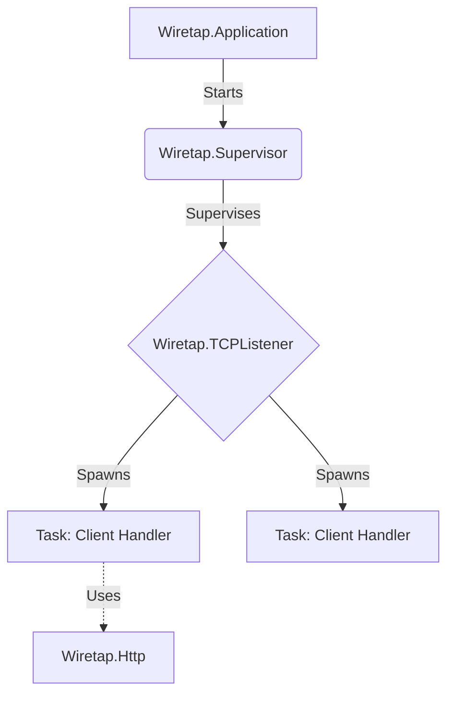

# Wiretap

**Work In Progress**

Wiretap is a minimal TCP/HTTP server implementation in Elixir (Educational).

## Architecture (Minimal)

The application follows a standard OTP supervision tree structure:

- **Wiretap.Application**: The entry point ensuring the system starts.
- **Wiretap.Supervisor**: Supervises the TCP Listener.
- **Wiretap.TCPListener**: Listens on port `4010`. Accepts connections and spawns a specific `Task` for each client to ensure concurrency.
- **Wiretap.Http**: (WIP) Module responsible for parsing raw binary data into HTTP requests and formatting responses.

## Todo

- [ ] **HTTP Parsing**
    - [ ] Parse Request Line (Method, Target, Version)
    - [ ] Parse Headers
    - [ ] Parse Body
- [ ] **Routing**
    - [ ] Simple route matching mechanism
- [ ] **Response Handling**
    - [ ] valid HTTP/1.1 response generation
- [ ] **Concurrency & Robustness**
    - [ ] Refine Task supervision (Task.Supervisor?)
- [ ] **Configuration**
    - [ ] Make port configurable
